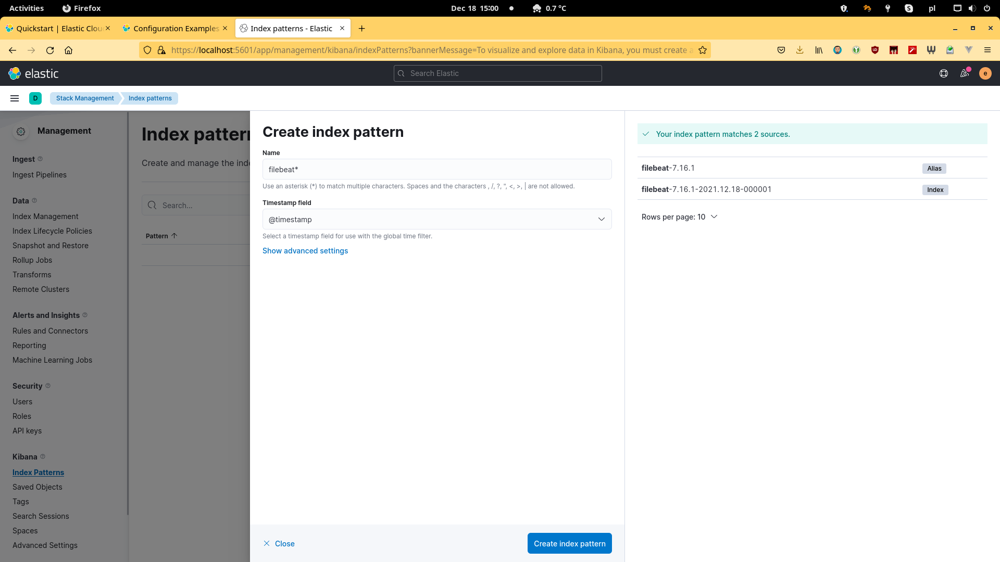
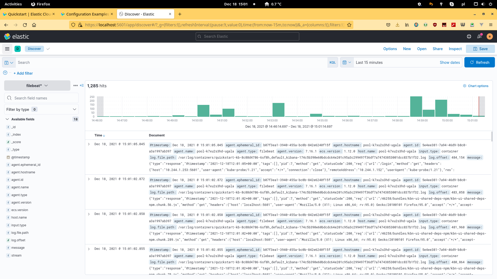

# Intro
This is an attempt to complete [DigitalOcean Kubernetes Challenge](https://www.digitalocean.com/community/pages/kubernetes-challenge).

I'm pretty familiar with Docker but I'm completely new to k8s. I also has some experience with ELK stack but mostly as user not as operator. That is why I decided to take a task for beginners and tried to deploy a log monitoring system to k8s cluster.

I tried several on-line tutorials on how to deploy ELK stack in k8s but somehow they were not working and pretty outdated (e.g. using ELK v6). At the end I found an [official guide from Elastic](https://www.elastic.co/guide/en/cloud-on-k8s/current/k8s-overview.html) on how to setup ELK in the cloud.

Below there are steps I did to achieve the goal.

# Prerequisites

* A k8s cluster. I'm using [DigitalOcean Kubernetes (DOKS)](https://docs.digitalocean.com/products/kubernetes/) which can be set in 2 minutes.
* `doctl` tool to communicate with DOKS.
* `kubectl` tool to control the cluster.

# Steps

## Connect to cluster

In case of [DOKS](https://docs.digitalocean.com/products/kubernetes/how-to/connect-to-cluster/) this can be done using `doctl` command:

```bash
doctl kubernetes cluster kubeconfig save <config-id>
```

## Deploy ECK in your Kubernetes cluster
With Elastic Cloud on Kubernetes (ECK) you can extend the basic Kubernetes orchestration capabilities to easily deploy, secure, upgrade your Elasticsearch cluster, and much more.

```bash
kubectl create -f https://download.elastic.co/downloads/eck/1.9.1/crds.yaml
kubectl apply -f https://download.elastic.co/downloads/eck/1.9.1/operator.yaml
```

## Deploy an Elasticsearch cluster
Apply a simple Elasticsearch cluster specification, with one Elasticsearch node:

```bash
cat <<EOF | kubectl apply -f -
apiVersion: elasticsearch.k8s.elastic.co/v1
kind: Elasticsearch
metadata:
  name: quickstart
spec:
  version: 7.16.1
  nodeSets:
  - name: default
    count: 1
    config:
      node.store.allow_mmap: false
EOF
```
Get an overview of the current Elasticsearch clusters in the Kubernetes cluster, including health, version and number of nodes:

```bash
kubectl get elasticsearch
```

```
NAME          HEALTH    NODES     VERSION   PHASE         AGE
quickstart    green     1         7.16.1     Ready         1m
```
After a while, the PHASE turns into Ready, and HEALTH becomes green.

In case the access to pod logs is required:
```bash
kubectl logs -f quickstart-es-default-0
```

### Access the Elasticsearch

1. Get the credentials.

  A default user named `elastic` is automatically created with the password stored in a Kubernetes secret:

  ```bash
PASSWORD=$(kubectl get secret quickstart-es-elastic-user -o go-template='{{.data.elastic | base64decode}}')
```

2. Request the Elasticsearch endpoint.

  Use the following command in a *separate* terminal:

  ```bash
  kubectl port-forward service/quickstart-es-http 9200
  ```

  Then request localhost:

  ```bash
    curl -u "elastic:$PASSWORD" -k "https://localhost:9200"
  ```

  The response should look like this:
  ```
  {
    "name" : "quickstart-es-default-0",
    "cluster_name" : "quickstart",
    "cluster_uuid" : "wQaCf5C6Qb68dmDqi2M8ow",
    "version" : {
      "number" : "7.16.1",
      ...
    },
    "tagline" : "You Know, for Search"
  }
```

## Deploy Kibana

To deploy your Kibana instance go through the following steps.

1. Specify a Kibana instance and associate it with your Elasticsearch cluster:

  ```bash
    cat <<EOF | kubectl apply -f -
    apiVersion: kibana.k8s.elastic.co/v1
    kind: Kibana
    metadata:
      name: quickstart
    spec:
      version: 7.16.1
      count: 1
      elasticsearchRef:
        name: quickstart
    EOF
```

2. Monitor Kibana health and creation progress.

  Similar to Elasticsearch, you can retrieve details about Kibana instances:

  ```bash
    kubectl get kibana
```

3. Access Kibana.

  Use kubectl port-forward to access Kibana from your local workstation:

  ```bash
    kubectl port-forward service/quickstart-kb-http 5601
  ```  

    Now Kibana should be accessable by URL https://localhost:5601 in your browser.

    Login as the elastic user. The password can be obtained with the following command:

    ```bash
    kubectl get secret quickstart-es-elastic-user -o=jsonpath='{.data.elastic}' | base64 --decode; echo
    ```

## Filebeat
1. The following specification allows to deploy Filebeat and collect the logs of all containers running in the Kubernetes cluster.

  ```bash
cat <<EOF | kubectl apply -f -
apiVersion: beat.k8s.elastic.co/v1beta1
kind: Beat
metadata:
  name: quickstart
spec:
  type: filebeat
  version: 7.16.1
  elasticsearchRef:
    name: quickstart
  config:
    filebeat.inputs:
    - type: container
      paths:
      - /var/log/containers/*.log
  daemonSet:
    podTemplate:
      spec:
        dnsPolicy: ClusterFirstWithHostNet
        hostNetwork: true
        securityContext:
          runAsUser: 0
        containers:
        - name: filebeat
          volumeMounts:
          - name: varlogcontainers
            mountPath: /var/log/containers
          - name: varlogpods
            mountPath: /var/log/pods
          - name: varlibdockercontainers
            mountPath: /var/lib/docker/containers
        volumes:
        - name: varlogcontainers
          hostPath:
            path: /var/log/containers
        - name: varlogpods
          hostPath:
            path: /var/log/pods
        - name: varlibdockercontainers
          hostPath:
            path: /var/lib/docker/containers
EOF
```

2. Monitor Beats health and creation progress.

```bash
kubectl get beat
```

## Setup index pattern in Kibana
To view data in Kibana an index pattern should be created. To do this in the main menu go to *Stack Managament* -> *Index patterns* and click the *Create index pattern* button. Then enter index pattern as `*` or `filebeat*` so it will match index names created by Filebeat.



After that on *Discover* page the data should be visible.



# Conclusion

As you can see with DOKS and ECK deployment of ELK cluster for testing is pretty easy.
